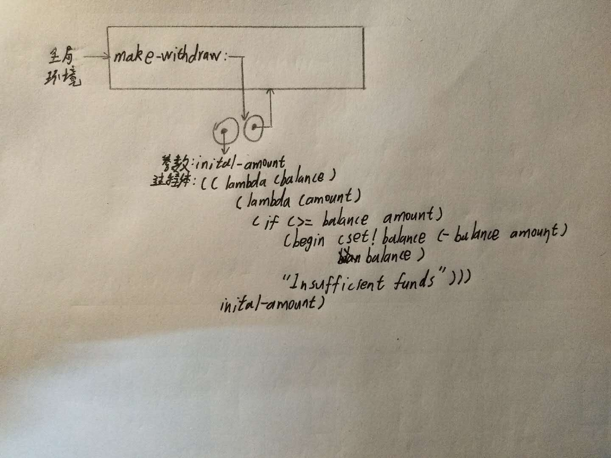
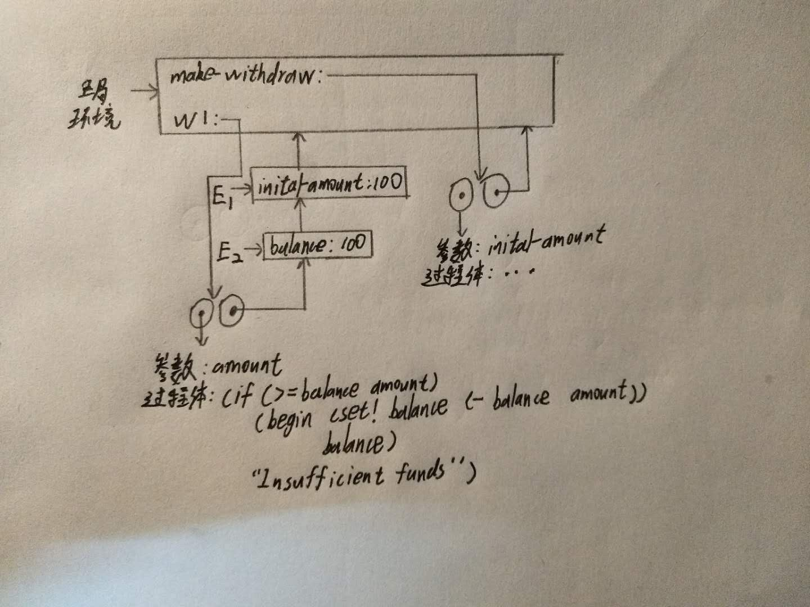
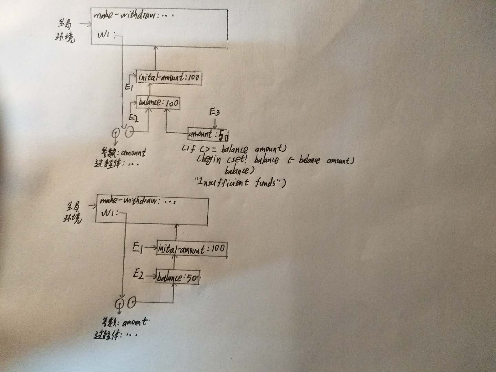
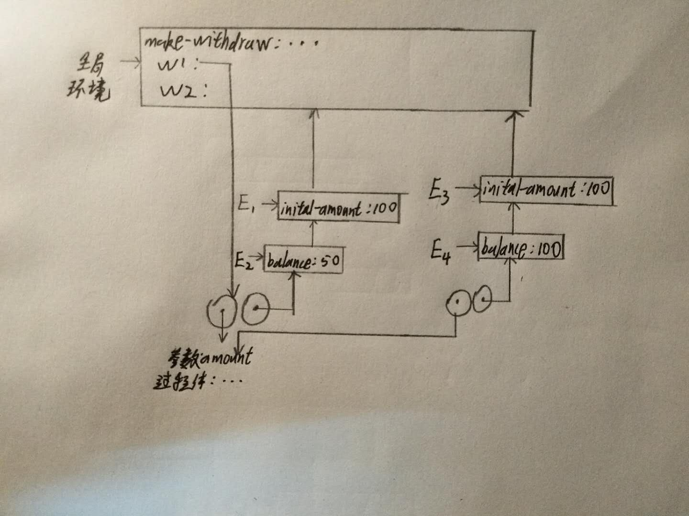

- 用lambda表达式改写make-withdraw过程

```
(define make-withdraw
    (lambda (initial-amount)
        ((lambda (balance)
            (lambda (amount)
                (if (>= balance amount)
                    (begin (set! balance (- balance amount))
                           balance)
                    "Insufficient funds")))
         initial-amount)))
```

- 定义make-withdraw

  


- 调用(define w1 (make-withdraw 100))

  


- 调用(w1 50)

  


- 调用(define w2 (make-withdraw 100))

  
