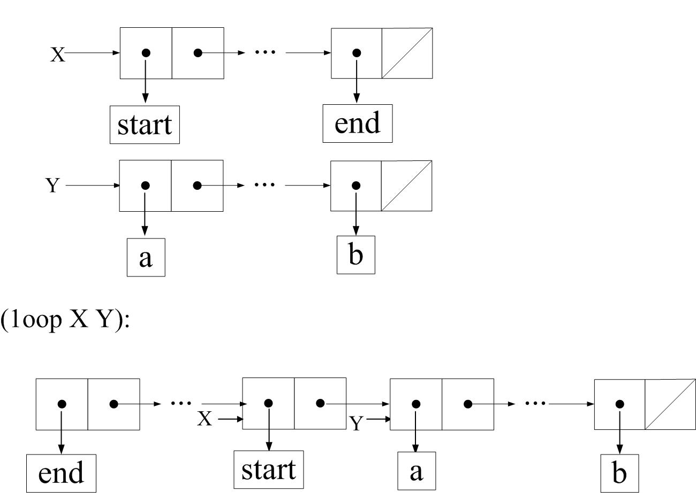

- 给出书中的代码
```
(define (mystery x)
    (define (loop x y)
        (if (null? x)
            y
            (let ((temp (cdr x)))
                (set-cdr! x y)
                (loop temp x))))
    (loop x '()))
```

- `简单分析一下loop过程的代码可以知道，它将x翻转之后把cdr指针指向了y。`

  

`因此mystery就是将x翻转。`