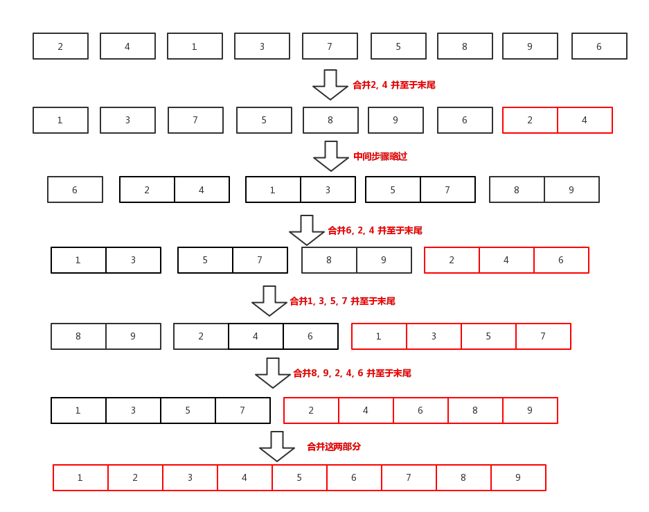

# 归并排序算法

## 算法核心思想

- **合并两个列表L1、L2**
  - 如果`L1`、`L2`中有一个为空，则返回另一个.
  - 否则分别取`L1`、`L2`的首元素`x1`、`x2`
    - 如果`x1`小于等于`x2`，则将`x1`作为新列表的首元素，并继续合并`L1`的剩余部分和`L2`.
    - 如果`x1`大于`x2`，则将`x2`作为新列表的首元素，并继续合并`L1`和`L2`的剩余部分.

```scheme
(define (merge L1 L2)
    (cond ((null? L1) L2)
          ((null? L2) L1)
          (else
            (let ((x1 (car L1)) (x2 (car L2)))
                (if (<= x1 x2)
                    (cons x1 (merge (cdr L1) L2))
                    (cons x2 (merge L1 (cdr L2))))))))
```

- **归并排序**
  - 每次选取列表的头两个元素进行合并然后舍弃，并将合并之后元素放置列表末尾，继续对新列表进行归并排序，直到列表中只有一个元素.


```scheme
(define (merge-sort L)
    (define (transform x)
        (if (number? x)
            (list x)
            x))
    (cond ((null? L) '())
          ((= (length L) 1) (car L))
          (else
            (let ((l1 (transform (car L)))
                  (l2 (transform (cadr L))))
                (let ((new (list (merge l1 l2))))
                    (merge-sort (append (cddr L) new)))))))
```

- [代码文件](merge-sort.scm)

