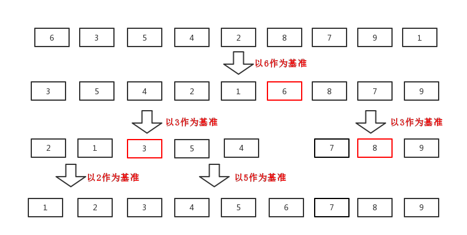

# 快速排序算法

## 算法核心思想

- 每次选取第一个元素作为基准，并采用过滤器`filter`将剩余元素中小于等于基准的作为`small`部分、剩余元素中大于基准的作为`big`部分，然后对`small`和`big`部分进行快速排序，最后按`small-基准-big`的顺序组合成新的列表，直到列表中只有一个元素为止.



## 代码展示

- [代码文件](quicksort.scm)

```scheme
(define (quicksort L)
    (if (null? L)
        '()
        (let ((small (quicksort (filter (lambda (x) (<= x (car L)))
                                        (cdr L))))
              (big (quicksort (filter (lambda (x) (> x (car L)))
                                      (cdr L)))))
            (append small (cons (car L) big)))))
```

